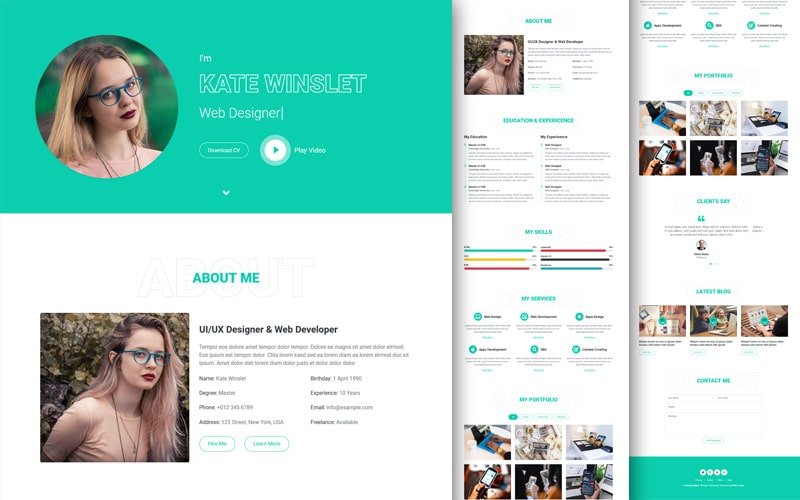

### RUSH - PWD
Piscine Web Discovery es una piscina de 5 días, para dar a conocer a 42 personas que tengan curiosidad y quieren dar un giro a su vida. No importa si sabes programar o no, ni la edad. En esta Piscine inmersiva las personas participantes han aprendido HTML, CSS y JavaScript, así como la innovadora metodología de 42. Una experiencia disruptiva presencial que les ha permitido experimentar lo que es 42 de forma 100% gratuita.
> [Click aquí](https://github.com/zafraedu/42-Projects/tree/master/42-discovery_web) para ver los proyectos de la ***discovery web*** de 42 al completo.

  

